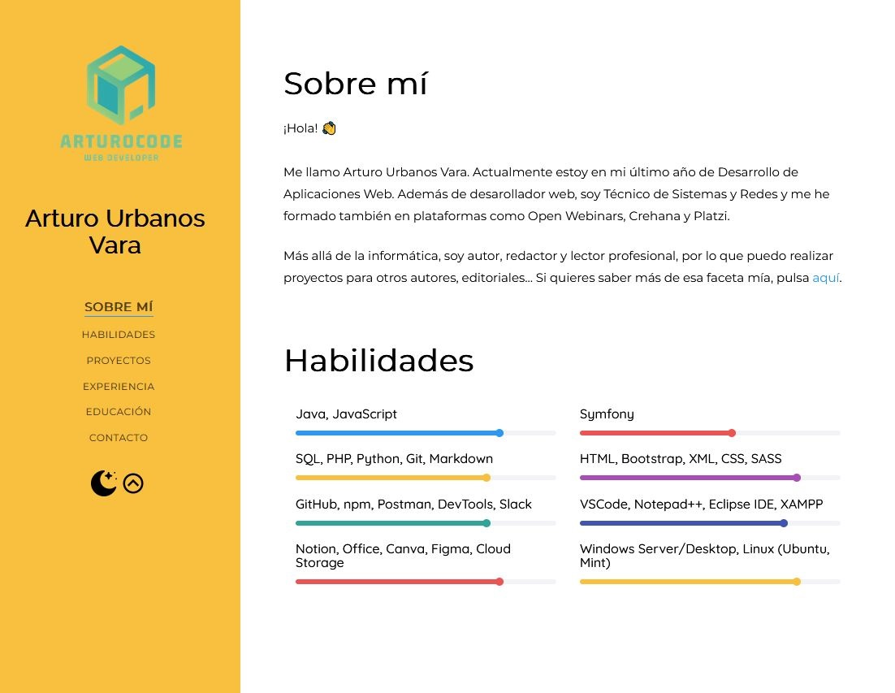
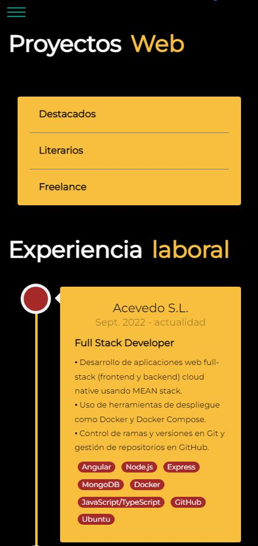

# CV Virtual 

## Técnico Superior de Desarrollo de Aplicaciones Web y Sistemas y Redes

### Es una sola página en la que están estas secciones:

- Breve información sobre mí
- Idiomas
- Proyectos Web (Destacados, Literarios y Freelance)
- Experiencia laboral
- Educación y cursos
- Contacto

##### Incluye Modo Claro/Oscuro, Navegación por secciones, Ir hacia el comienzo de la página y distintas animaciones

<table>
    <tr>
        <td></td>
        <td></td>
    </tr>
</table>
